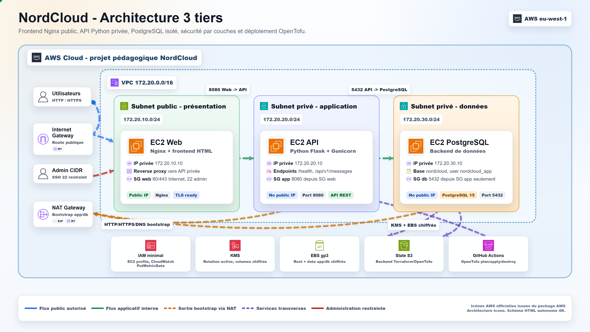
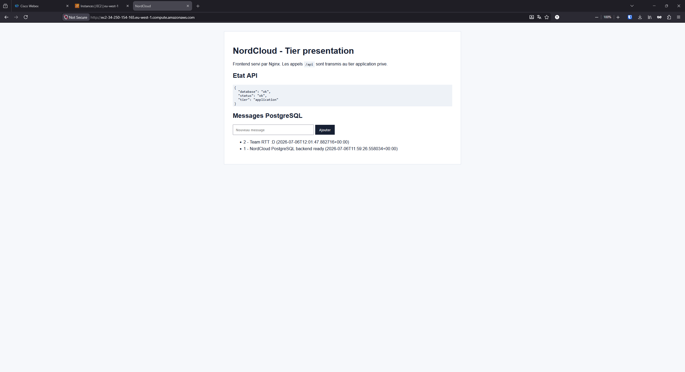
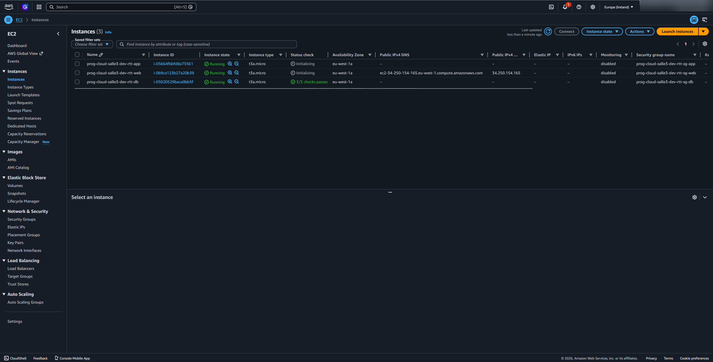
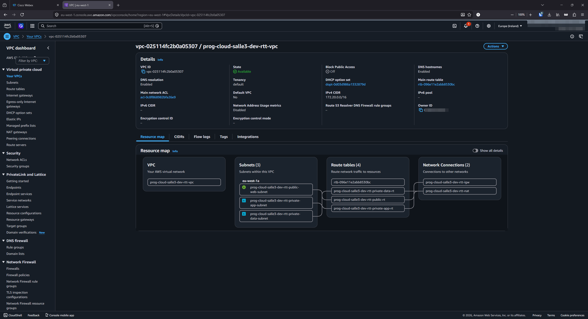
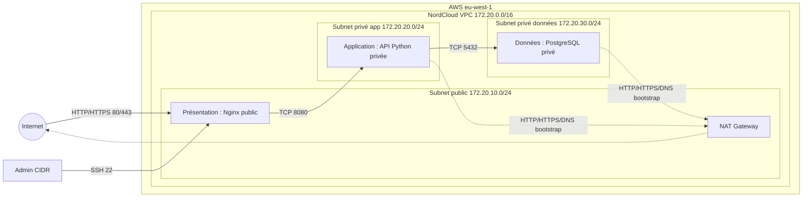

<div align="center">

# NordCloud Salle 3 - Architecture 3 tiers

### Projet final OpenTofu/Terraform réalisé par l'équipe RTT

**Robin Thiriet · Thomas Fauroux · Tristan Truckle**

<p>
  <a href="https://www.linkedin.com/in/robin-thiriet-03221723b/">
    
  </a>
  <a href="https://www.linkedin.com/in/thomas-fauroux/">
    
  </a>
  <a href="https://www.linkedin.com/in/tristan-truckle/">
    
  </a>
</p>

<p>
  
  
  
  
  
</p>

<p>
  <a href="../.github/workflows/opentofu-t3-j4-plan.yaml">Workflow plan</a>
  ·
  <a href="../.github/workflows/opentofu-t3-j4-apply.yaml">Workflow apply</a>
  ·
  <a href="../.github/workflows/opentofu-t3-j4-destroy.yaml">Workflow destroy</a>
  ·
  <a href="./docs/architecture-3tiers.html">Schéma HTML 4K</a>
</p>

</div>

---

## Équipe RTT

<table>
  <tr>
    <td align="center" width="33%">
      <a href="https://www.linkedin.com/in/robin-thiriet-03221723b/">
        
      </a>
      <br>
      <strong>Robin Thiriet</strong>
      <br>
      
      <br>
      <sub>Option carrière : nuage breton-compatible :D</sub>
    </td>
    <td align="center" width="33%">
      <a href="https://www.linkedin.com/in/thomas-fauroux/">
        
      </a>
      <br>
      <strong>Thomas Fauroux</strong>
      <br>
      <sub>Équipe RTT - NordCloud</sub>
    </td>
    <td align="center" width="33%">
      <a href="https://www.linkedin.com/in/tristan-truckle/">
        
      </a>
      <br>
      <strong>Tristan Truckle</strong>
      <br>
      <sub>Équipe RTT - NordCloud</sub>
    </td>
  </tr>
</table>

---

## Vue d'ensemble

Ce dossier contient la v1 du dernier TP NordCloud : une architecture 3 tiers provisionnée avec OpenTofu/Terraform sur AWS, documentée pour l'audit et illustrée avec des captures réelles.

| Couche | Rôle | Exposition |
| --- | --- | --- |
| Présentation | EC2 Web avec Nginx, frontend HTML et reverse proxy `/api` | Public, ports 80/443, SSH limité au CIDR admin |
| Application | EC2 privée avec API Python Flask/Gunicorn | Privé, port 8080 depuis le SG web uniquement |
| Données | EC2 privée avec PostgreSQL 15 | Privé, port 5432 depuis le SG app uniquement |

Principes couverts :

- segmentation réseau par VPC, subnets publics/privés et route tables dédiées ;
- flux applicatifs stricts : Internet -> Web -> API -> PostgreSQL ;
- bootstrap privé via NAT Gateway, sans IP publique sur app/db ;
- Security Groups en couches avec règles minimales ;
- volumes EC2/EBS chiffrés avec KMS ;
- IAM à privilège minimal pour les instances ;
- workflows GitHub Actions dédiés au `plan`, `apply` et `destroy` ;
- documentation RGPD, ISO 27017, SecNumCloud, sécurité, coûts et progression.

> Le nom du dossier reste volontairement `teraform-salle3-jour4`, conformément à la consigne initiale.

---

## Captures

Les captures du projet sont disponibles dans [`./screenshots`](./screenshots).

<table>
  <tr>
    <td width="50%">
      <a href="./screenshots/architecture-3tiers-4k.png">
        
      </a>
      <br>
      <strong>Schéma 4K</strong><br>
      Vue complète des flux Web, API, PostgreSQL, NAT, KMS, EBS, IAM et GitHub Actions.
    </td>
    <td width="50%">
      <a href="./screenshots/nordcloud-web-api-postgresql.png">
        
      </a>
      <br>
      <strong>Application web</strong><br>
      Frontend Nginx, appel API Python et lecture/écriture PostgreSQL.
    </td>
  </tr>
  <tr>
    <td width="50%">
      <a href="./screenshots/aws-ec2-instances-3tiers.png">
        
      </a>
      <br>
      <strong>Instances EC2</strong><br>
      Les trois tiers sont déployés en `t3a.micro` dans `eu-west-1a`.
    </td>
    <td width="50%">
      <a href="./screenshots/aws-vpc-resource-map.png">
        
      </a>
      <br>
      <strong>VPC resource map</strong><br>
      Vue AWS du VPC, des subnets, route tables, Internet Gateway et NAT Gateway.
    </td>
  </tr>
</table>

---

## Architecture



## Arborescence

```text
teraform-salle3-jour4/
├── docs/
│   ├── architecture-3tiers.html
│   ├── compliance-grid.md
│   ├── cost-note.md
│   ├── progression-grid.md
│   └── security-note.md
├── modules/
│   ├── compute/
│   ├── iam/
│   ├── network/
│   ├── scheduler/
│   └── security/
├── screenshots/
├── user_data/
│   ├── app.sh
│   ├── db.sh
│   └── web.sh
├── main.tf
├── providers.tf
├── variables.tf
├── outputs.tf
└── terraform.auto.tfvars
```

---

## Déploiement local

```powershell
cd teraform-salle3-jour4
$env:TF_VAR_db_app_password = "N0rdCloud!Demo-2026.WithSymbols"
terraform init
terraform fmt -recursive
terraform validate
terraform plan
terraform apply
```

À vérifier avant `plan` :

| Variable | Rôle | Note |
| --- | --- | --- |
| `prenom` | Nom d'équipe affiché dans les tags | Valeur projet : `RTT` |
| `resource_suffix` | Suffixe technique des noms AWS | À garder stable après un premier apply |
| `admin_cidr` | CIDR autorisé en SSH vers le web | Ne pas ouvrir en `0.0.0.0/0` |
| `db_app_password` | Mot de passe API -> PostgreSQL | À injecter via `TF_VAR_db_app_password` ou secret GitHub |

`resource_suffix` est volontairement séparé de `prenom` : renommer une équipe ne doit pas forcer le remplacement de ressources AWS immuables comme les Security Groups, rôles IAM ou alias KMS.

---

## GitHub Actions

Trois workflows sont dédiés à ce TP :

| Workflow | Objectif | Déclenchement |
| --- | --- | --- |
| [`opentofu-t3-j4-plan.yaml`](../.github/workflows/opentofu-t3-j4-plan.yaml) | Format, lint, scan, init, validate et plan | Push/PR ou manuel |
| [`opentofu-t3-j4-apply.yaml`](../.github/workflows/opentofu-t3-j4-apply.yaml) | Plan puis apply contrôlé | Manuel avec confirmation `APPLY` |
| [`opentofu-t3-j4-destroy.yaml`](../.github/workflows/opentofu-t3-j4-destroy.yaml) | Destruction contrôlée | Manuel avec confirmation `DESTROY` |

Secrets attendus :

| Secret GitHub | Usage |
| --- | --- |
| `AWS_ACCESS_KEY_ID` | Authentification AWS pour OpenTofu |
| `AWS_SECRET_ACCESS_KEY` | Authentification AWS pour OpenTofu |
| `DB_APP_PASSWORD` | Mot de passe PostgreSQL injecté dans `TF_VAR_db_app_password` |

---

## Sécurité et conformité

La conformité est traitée comme une cartographie de mesures techniques, pas comme une certification.

| Référentiel | Position v1 |
| --- | --- |
| RGPD | Protection par conception : cloisonnement, minimisation, chiffrement, traçabilité et limitation des accès. |
| ISO 27017 | Bonnes pratiques cloud : responsabilité partagée, segmentation, contrôle d'accès, durcissement et documentation. |
| SecNumCloud | Principes repris : isolation, chiffrement, administration maîtrisée et traçabilité. La qualification SecNumCloud ne peut pas être revendiquée sur cette v1 AWS. |

Documents associés :

- [Note de sécurité](./docs/security-note.md)
- [Codes des Salles 1 et 2](./docs/codes-salles.md)
- [Grille de conformité](./docs/compliance-grid.md)
- [Note FinOps](./docs/cost-note.md)
- [Grille de progression](./docs/progression-grid.md)
- [Schéma HTML 4K](./docs/architecture-3tiers.html)

---

## Livrables

- Code OpenTofu/Terraform commenté par intention.
- Modules séparés : réseau, sécurité, IAM, compute et scheduler.
- User-data applicatifs : Nginx, API Flask/Gunicorn et PostgreSQL.
- Workflows GitHub Actions pour plan, apply et destroy.
- Captures dans [`./screenshots`](./screenshots).
- Documentation sécurité, conformité, coûts et progression.

<div align="center">

**RTT - Robin, Thomas, Tristan**  
NordCloud Salle 3 Jour 4

</div>
